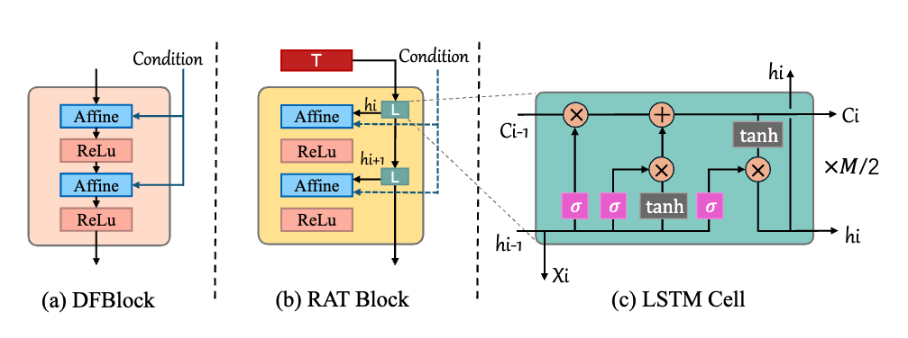
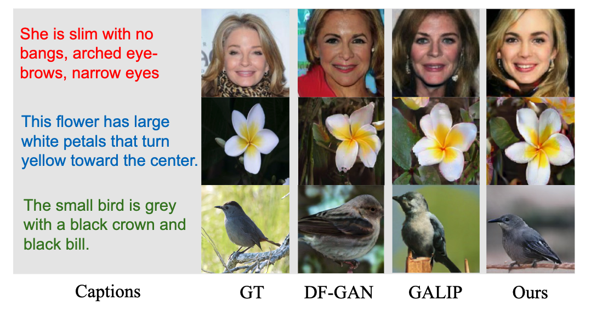

# RATLIP

RATLIP: Generative Adversarial CLIP Text-to-Image Synthesis Based  on Recurrent Affine Transformations



## Requirements

**At least 1x24GB 3090 GPU (for training), only CPU (for sampling)**

1. **Environment**

```Bash
conda create -n RATLIP python=3.9
conda activate RATLIP

```

2. **Clone this repo**

```Bash
git clone https://github.com/OxygenLu/RATLIP.git
```

3. **Install the requirements**

```Bash
cd RATLIP
pip install -r requirements.txt

```

4. **Install CLIP**

```Bash
cd ../
git clone https://github.com/openai/CLIP.git
python ./CLIP/setup.py install

```

## Usage


### Train

```Bash
cd RALIP/code
bash scripts/train.sh ./cfg/bird.yml
```

### Test

```Bash
bash scripts/test.sh ./cfg/bird.yml
```

### Resume

**You can change ***state_epoch*** and the corresponding ***weight*** to continue training at breakpoints**

### TensorBoard

**The results are stored in TensorBoard files under ./logs**

```Bash
tensorboard --logdir your_path --port 8166
```

## Sampling

**The** *sample.ipynb* **can be used to sample**

## Result

### Visualization



### Experiments

Compare RATLIP and state-of-the-art models on FID values (the smaller, the better).

| Model   | CUB   | CelebA-tiny |
| ------- | ----- | ----------- |
| AttnGAN | 23.98 | 125.98      |
| LAFITE  | 14.58 | -           |
| DF-GAN  | 14.81 | 137.6       |
| GALIP   | 10    | 94.45       |
| Ours    | 13.28 | 81.48       |

Compare RATLIP and state-of-the-art models on CLIP score values (the bigger, the better).

| Model   | CUB   | CelebA-tiny | Oxford |
| ------- | ----- | ----------- | ------ |
| AttnGAN | -     | 21.15       | -      |
| LAFITE  | 31.25 | -           | -      |
| DF-GAN  | 29.20 | 26.67       | 24.41  |
| GALIP   | 31.60 | 31.77       | 27.95  |
| Ours    | 32.03 | 31.94       | 28.91  |

## Citing RATLIP

```Bash

```

## Acknowledgement

* This code is adapted from [GALIP](https://github.com/tobran/GALIP) and [RAT-GAN](https://github.com/senmaoy/RAT-GAN).
* We thank Ming Tao, Bing-Kun Bao and Senmao Ye for their elegant and efficient code base.
